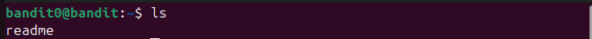
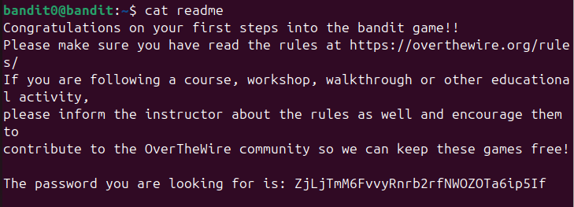
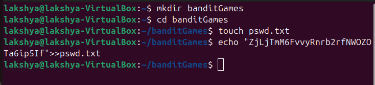

## Bandit level 0→1
Go to website https://overthewire.org/wargames/bandit for hint of each level.

## 🎯 Challenge
The goal is to find the password for `bandit1` (it’s stored in a file called `readme` in the home directory).  
We are given:
- Host: `bandit.labs.overthewire.org`
- Port: `2220`
- Username: `bandit0`
- Password: `bandit0`

In the previous level we logged into to [bandit0](level0.md)
## 📝 Steps

1. **Retrieve password for Level1**

  - Once logged in, list files
```bash
ls
 ```


  - Read the file **readme**
```bash
cat readme
```

You can copy the password
   - Exit the session 
```bash
exit 
   ```


<details>

   - `ls` : list directory contents

      `ls -a` : don't ignore files starting with . (it is used to list hidden files)


   - `cat filename` : read and display the contents of file
   - `exit` : closes current shell session
</details>

2. **Save the password on local system** 
   
   As the game suggests we can create a file for storing password

- making a directory **banditGames**
   ```bash
   mkdir banditGames
   ```
- entering the directory
   ```bash
   cd banditGames
   ```
- saving password to a file **pswd.txt**
   ```bash
   echo "ZjLjTmM6FvvyRnrb2rfNWOZOTa6ip5If__laksh">>pswd.txt
   ```
  (Note: `touch pswd.txt` can be used to create the file, but `echo` will create it automatically if it doesn’t exist.)


  

<details>

- `mkdir` : make directory
- `cd` : change directory
- `echo` : prints text or variable to the terminal

You can combine `echo` with redirection operators (> or >>) to save text into files

`echo "smth">filename` : Creates file if don't exist or overwrites the existing file with given text
`echo "smth">>filename` : Appends text to the end of a file without deleting what’s already inside.
</details>

---
✨ Pro tip: You can always refer to the manual pages for deeper understanding.
Just type:
```bash
man <command>
```
for example :
```bash
man ls
```

---
#### 💬 Need help? [Text me on WhatsApp ➡️](https://wa.me/918619372532?text=Hello)
