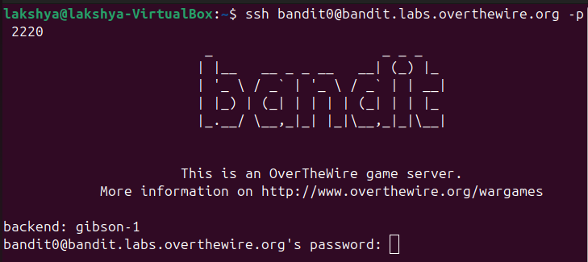

## Bandit level 0
Go to website https://overthewire.org/wargames/bandit for hint of each level.

## 🎯 Challenge
The goal is to log into the game using SSH.  
We are given:
- Host: `bandit.labs.overthewire.org`
- Port: `2220`
- Username: `bandit0`
- Password: `bandit0`

---
## 📝 Steps

1. **Open your terminal**  
   On your Linux machine, launch the terminal application.

2. **Run the SSH command**  
   Type the following command and press **Enter**:
   ```bash
   ssh bandit0@bandit.labs.overthewire.org -p 2220
   ```
   <details>
   
   - `ssh` : Secure Shell, used to connect to remote servers
   - `bandit0@...`  : Username and host
   - `-p 2220`  : specifies the custom port 2220(default uses port 22)
   </details>


3. **Enter password** 
   ```bash 
   bandit0 
   ```
(Note: The password will remain hidden as you type — this is normal.)

4. **After successful login** you will see:
    ```bash
    bandit0@bandit:~$
    ```
   
---
**Explore the environment**
 
You can now explore the system using command 'ls', 'cat', etc., and enter `exit` to disconnect to the network.


✨ Pro tip: You can always refer to the manual pages for deeper understanding.
Just type:
```bash
man <command>
```
for example :
```bash
man ls
```

---
#### 💬 Need help? [Text me on WhatsApp ➡️](https://wa.me/918619372532?text=Hello)