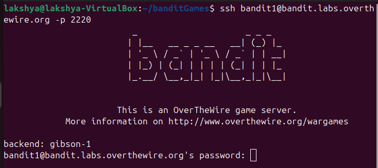
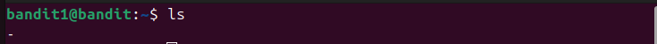
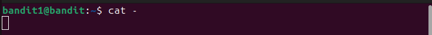
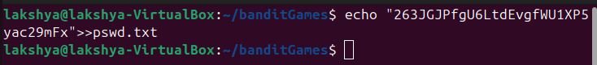

## Bandit level 1→2
Go to website https://overthewire.org/wargames/bandit for hint of each level.

## 🎯 Challenge
The goal is to find the password for the next level which is stored in a file called `-` located in the home directory.
We are given:
- Host: `bandit.labs.overthewire.org`
- Port: `2220`
- Username: `bandit1`
- Password: `(use the one from Level 0→1)`

In the previous level we retrieved the password for [bandit1](level0-1.md)
## 📝 Steps

1. **Open your terminal**  
   On your Linux machine, launch the terminal application.

2. **Run the SSH command**  
   Type the following command and press **Enter**:
   ```bash
   ssh bandit1@bandit.labs.overthewire.org -p 2220
   ```
  
<details>

  - `ssh` : Secure Shell, used to connect to remote servers
  - `bandit1@...`  : Username and host
  - `-p 2220`  : specifies the custom port 2220(default uses port 22)
</details>



3. **Enter password**
   ```bash 
   ZjLjTmM6FvvyRnrb2rfNWOZOTa6ip5If__laksh 
   ```
(Note: The password will remain hidden as you type — this is normal.)

⚠️ **Disclaimer**: Password is intentionally altered. Use the actual one you retrieved in the previous level.

4. **Retrieve password for Level2**

- Once logged in, list files
```bash
ls
 ```


- Read the file `-`
```bash
cat ./-
```
<details>

- Most commands interpret `-` as meaning “read from standard input”
- So when you type
```bash
cat -
```

cat waits for you to type something manually, because it thinks you want to feed it input interactively.



- By writing `./-`, you’re telling the shell: “Look in the current directory (./) for a file literally named `-`.”
</details>


You can copy the password


- **Exit the session**
```bash
exit 
   ```


<details>

- `ls` : list directory contents

  `ls -a` : don't ignore files starting with . (it is used to list hidden files)


- `cat filename` : read and display the contents of file
- `exit` : closes current shell session
</details>

5. **Save the password on local system**

    Saving password to the file **pswd.txt**
```bash
echo "263JGJPfgU6LtdEvgfWU1XP5yac29mFx__laksh">>pswd.txt
```
  


<details>

- `mkdir` : make directory
- `cd` : change directory
- `echo` : prints text or variable to the terminal
    <details>
    You can combine `echo` with redirection operators (> or >>) to save text into files

  `echo "smth">filename` : Creates file if don't exist or overwrites the existing file with given text.

  `echo "smth">>filename` : Appends text to the end of a file without deleting what’s already inside.
    </details>
</details>

---
✨ Pro tip: You can always refer to the manual pages for deeper understanding.
Just type:
```bash
man <command>
```
for example :
```bash
man ls
```

---
#### 💬 Need help? 
- [ExplainShell](https://explainshell.com): Paste any command (like `ls -lh`) and it breaks down each flag and argument.
- Reading resource :  [Linux Command Line and Shell Scripting Bible](https://github.com/linuxqueenn12/popular-Hacking-books-/blob/833e3e07dea7c463137ac6b689e1eba3236a5029/Linux%20Command%20Line%20and%20Shell%20Scripting%20Bible%203rd%20Edition%20%7BPRG%7D.pdf)

[Text me on WhatsApp ➡️](https://wa.me/918619372532?text=Hello)
