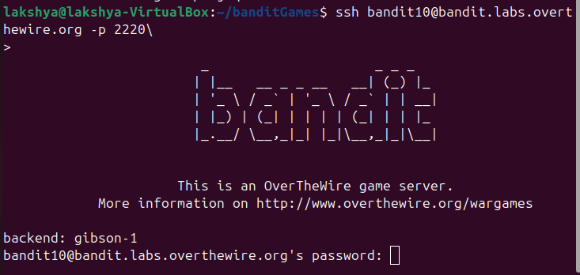
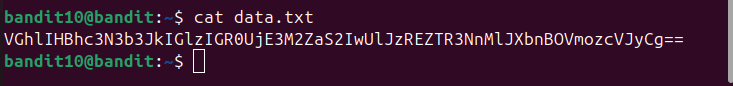
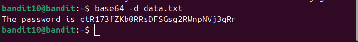

## Bandit level 10→11
Go to website https://overthewire.org/wargames/bandit for hint of each level.


## 🎯 Challenge
The goal is to find the password for the next level which is stored in the file data.txt, which contains base64 encoded data
We are given:

- Host: `bandit.labs.overthewire.org`
- Port: `2220`
- Username: `bandit10`
- Password: `(use the one from Level 9→10)`

In the previous level, we retrieved the password that lets us log in as [bandit10](level9-10.md)

## 📝 Steps

1. **Open your terminal**

On your Linux machine, launch the terminal application.

2. **Run the SSH command**

Type the following command and press **Enter**:
   ```bash
   ssh bandit10@bandit.labs.overthewire.org -p 2220
   ```

<details>

- `ssh` : Secure Shell, used to connect to remote servers
- `bandit10@...`  : Username and host
- `-p 2220`  : specifies the custom port 2220(default uses port 22)
</details>



3. **Enter password**
   Type the password you retrieved from Level 9 → 10

(⚠️**Note**: The password will remain hidden as you type — this is normal.)

4. **Retrieve password for Level11**

The file **data.txt** contains base64 encoded text. Decode it using:

```bash
base64 -d data.txt
```
<details>

- `base64` : command-line tool to encode/decode base64 data

- `-d` : tells the command to decode instead of encode

- `data.txt` : the file containing the encoded password

    

</details>

---



You can copy the password

### ⚡ Quick Tips
- Base64 encoding is often used to represent binary data in text form.
- You can test encoding/decoding with a simple string:
    ```bash
    echo "hello" | base64
    echo "aGVsbG8=" | base64 -d
    ```

- **Exit the session**
```bash
exit 
   ```


---
### 📜All used commands
<details>

- `ssh username@host` : Secure Shell, used to connect to remote servers
-  `base64 -d <filename>` : decode base64 encoded data
- `exit` : closes current shell session
</details>

---
✨ Pro tip: You can always refer to the manual pages for deeper understanding.
Just type:
```bash
man <command>
```
for example :
```bash
man base64
```
### ✅ Summary
- Log in as bandit10
- Run base64 -d data.txt
- The output will be the password for bandit11
- Exit the session

---
#### 💬 Need help?
- [ExplainShell](https://explainshell.com): Paste any command (like `ls -lh`) and it breaks down each flag and argument.
- Reading resource :  [Linux Command Line and Shell Scripting Bible](https://github.com/linuxqueenn12/popular-Hacking-books-/blob/833e3e07dea7c463137ac6b689e1eba3236a5029/Linux%20Command%20Line%20and%20Shell%20Scripting%20Bible%203rd%20Edition%20%7BPRG%7D.pdf)

[Text me on WhatsApp ➡️](https://wa.me/918619372532?text=Hello)