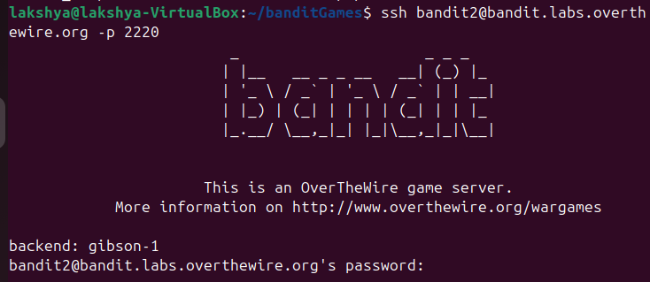
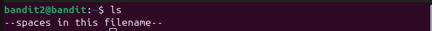
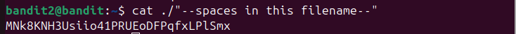
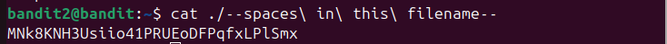

## Bandit level 2→3
Go to website https://overthewire.org/wargames/bandit for hint of each level.


## 🎯 Challenge
The goal is to find the password for the next level which is stored in a file called `--spaces in this filename--` located in the home directory.

We are given:

- Host: `bandit.labs.overthewire.org`
- Port: `2220`
- Username: `bandit2`
- Password: `(use the one from Level 1→2)`

In the previous level, we retrieved the password that lets us log in as [bandit2](level1-2.md)

## 📝 Steps

1. **Open your terminal**

On your Linux machine, launch the terminal application.

2. **Run the SSH command** 

Type the following command and press **Enter**:
   ```bash
   ssh bandit2@bandit.labs.overthewire.org -p 2220
   ```

<details>

- `ssh` : Secure Shell, used to connect to remote servers
- `bandit2@...`  : Username and host
- `-p 2220`  : specifies the custom port 2220(default uses port 22)
</details>



3. **Enter password**
   ```bash 
   263JGJPfgU6LtdEvgfWU1XP5yac29mFx__laksh 
   ```
(Note: The password will remain hidden as you type — this is normal.)

⚠️ **Disclaimer**: Password is intentionally altered. Use the actual one you retrieved in the previous level.

4. **Retrieve password for Level3**

- Once logged in, list files
```bash
ls
 ```


- Read the file `--spaces in this filename--`
```bash
cat "./--spaces in this filename--"
            Or
cat ./"--spaces in this filename--"
```
<details>

- Wrapping in quotes(" ") tells that shell to treat everything inside it as a single literal string

- By writing `./` before file name, you’re telling the shell: “Look in the current directory (./) for a file.”

- Files name starting with `-` must start with `./`, otherwise shell will interpret it as **stdin** and wait for input.
</details>



Or

```bash
cat ./--spaces\ in\ this\ filename--
```
<details>

- In the shell, spaces normally separate arguments. By writing `\`, you tell the shell “this space is part of the filename.” So `--spaces\ in\ this\ filename--` becomes a single continuous filename string.
</details>



You can copy the password


- **Exit the session**
```bash
exit 
   ```


---
### 📜All used commands
<details>

- `ssh username@host` : Secure Shell, used to connect to remote servers
- `ls` : list directory contents
- `cat <filename>` : read and display the contents of file
- `exit` : closes current shell session
</details>

---
✨ Pro tip: You can always refer to the manual pages for deeper understanding.
Just type:
```bash
man <command>
```
for example :
```bash
man ls
```

---
#### 💬 Need help?
- [ExplainShell](https://explainshell.com): Paste any command (like `ls -lh`) and it breaks down each flag and argument.
- Reading resource :  [Linux Command Line and Shell Scripting Bible](https://github.com/linuxqueenn12/popular-Hacking-books-/blob/833e3e07dea7c463137ac6b689e1eba3236a5029/Linux%20Command%20Line%20and%20Shell%20Scripting%20Bible%203rd%20Edition%20%7BPRG%7D.pdf)

[Text me on WhatsApp ➡️](https://wa.me/918619372532?text=Hello)
