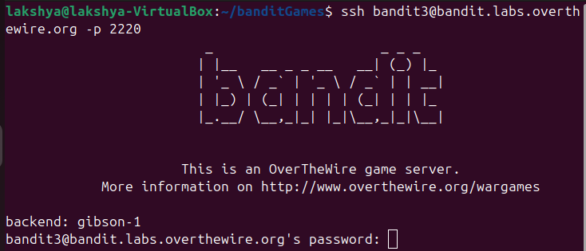
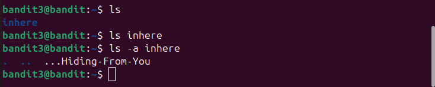
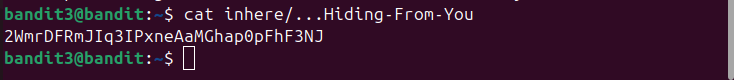

## Bandit level 3→4
Go to website https://overthewire.org/wargames/bandit for hint of each level.


## 🎯 Challenge
The goal is to find the password for the next level which is stored in a hidden file in the inhere directory.

We are given:

- Host: `bandit.labs.overthewire.org`
- Port: `2220`
- Username: `bandit3`
- Password: `(use the one from Level 2→3)`

In the previous level, we retrieved the password that lets us log in as [bandit3](level2-3.md)

## 📝 Steps

1. **Open your terminal**

On your Linux machine, launch the terminal application.

2. **Run the SSH command**

Type the following command and press **Enter**:
   ```bash
   ssh bandit3@bandit.labs.overthewire.org -p 2220
   ```

<details>

- `ssh` : Secure Shell, used to connect to remote servers
- `bandit3@...`  : Username and host
- `-p 2220`  : specifies the custom port 2220(default uses port 22)
</details>



3. **Enter password**
   ```bash 
   MNk8KNH3Usiio41PRUEoDFPqfxLPLSmx__laksh 
   ```
(Note: The password will remain hidden as you type — this is normal.)

⚠️ **Disclaimer**: Password is intentionally altered. Use the actual one you retrieved in the previous level.

4. **Retrieve password for Level4**

- Once logged in, list files in directory **inhere**
```bash
ls inhere
 ```
- Normally, `ls` only shows visible files, not the hidden ones. To reveal them, use:

```bash
ls -a inhere
```
- **Hidden files**: Files beginning with a dot (.) are hidden by default. That’s why `ls -a` is needed to reveal them.



### ⚡ Quick Tips
- Use `ls -lh` to check file sizes and permissions.

- Run `file <filename>` to confirm it’s a text file before cat.

---
- Read the file `...Hiding-From-You`
```bash
cat inhere/...Hiding-From-You
```



You can copy the password


- **Exit the session**
```bash
exit 
   ```


---
### 📜All used commands
<details>

- `ssh username@host` : Secure Shell, used to connect to remote servers
- `ls` : list directory contents
- `ls -a` : don't ignore files starting with . (it is used to list hidden files)
- `cat <filename>` : read and display the contents of file
- `exit` : closes current shell session
</details>

---
✨ Pro tip: You can always refer to the manual pages for deeper understanding.
Just type:
```bash
man <command>
```
for example :
```bash
man ls
```

---
#### 💬 Need help? 
- [ExplainShell](https://explainshell.com): Paste any command (like `ls -lh`) and it breaks down each flag and argument.
- Reading resource :  [Linux Command Line and Shell Scripting Bible](https://github.com/linuxqueenn12/popular-Hacking-books-/blob/833e3e07dea7c463137ac6b689e1eba3236a5029/Linux%20Command%20Line%20and%20Shell%20Scripting%20Bible%203rd%20Edition%20%7BPRG%7D.pdf)

[Text me on WhatsApp ➡️](https://wa.me/918619372532?text=Hello)