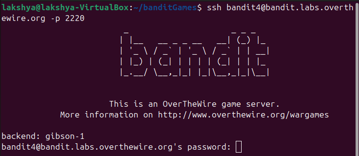
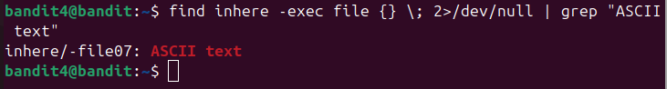
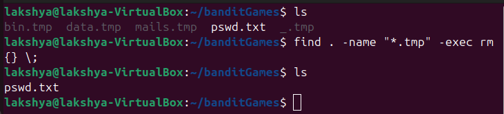
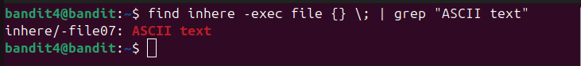
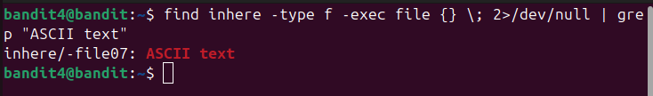

## Bandit level 4→5
Go to website https://overthewire.org/wargames/bandit for hint of each level.


## 🎯 Challenge
The goal is to find the password for the next level which is stored in the only human-readable file in the inhere directory.

We are given:

- Host: `bandit.labs.overthewire.org`
- Port: `2220`
- Username: `bandit4`
- Password: `(use the one from Level 3→4)`

In the previous level, we retrieved the password that lets us log in as [bandit4](level3-4.md)

## 📝 Steps

1. **Open your terminal**

On your Linux machine, launch the terminal application.

2. **Run the SSH command**

Type the following command and press **Enter**:
   ```bash
   ssh bandit4@bandit.labs.overthewire.org -p 2220
   ```

<details>

- `ssh` : Secure Shell, used to connect to remote servers
- `bandit4@...`  : Username and host
- `-p 2220`  : specifies the custom port 2220(default uses port 22)
</details>



3. **Enter password**
   ```bash 
   2WmrDFRmJIq3IPxneAaMGhap0pFhF3NJ__laksh 
   ```
(Note: The password will remain hidden as you type — this is normal.)

⚠️ **Disclaimer**: Password is intentionally altered. Use the actual one you retrieved in the previous level.

4. **Retrieve password for Level5**

- Once logged in, list files in directory **inhere**
```bash
ls inhere
 ```


- We used `file` command to find only **human-readable** file out of so many files in **inhere**.

```bash
find inhere -type f -exec file {} \; | grep "ASCII text"
```
<details>

- `find`  : used to search for files and directories. It can look inside folders and apply filters (like type, name, size).
- `find inhere` : it tells `find` to look inside the folder **inhere**
- `-type f` : Restricts the search to files only (not directories).
    
    command works fine even without it 
    
- `-exec` : This flag lets you run another command on each file that **find** discovers.
    Sample use-case :
    
- `file` : tells you the type of content inside a file.
- `{}` : it is a placeholder, the name of files from **find inhere** are placed inside it.
- `\;` : marks the end of the -exec command.
- `2>/dev/null` : This part hides the error.
    Works fine without this but is a good practice
    

- `|`**(pipe)** : Takes the output of one command and sends it as input to another.

  Here, the results of `file` are sent into `grep`.
- `grep` : searches for lines containing a specific word or phrase.
</details>




### ⚡ Quick Tips
- Use `ls -lh` to check file sizes and permissions.

- Run `file <filename>` to confirm it’s a text file before cat.

---
- Read the file `-file07`
```bash
cat inhere/-file07
```


You can copy the password


- **Exit the session**
```bash
exit 
   ```


---
### 📜All used commands
<details>

- `ssh username@host` : Secure Shell, used to connect to remote servers
- `ls` : list directory contents
- `find`  : used to search for files and directories. It can look inside folders and apply filters (like type, name, size).
- `file`  : tells you the type of content inside a file (e.g., text, binary, image).
- `grep`  : searches for lines containing a specific word or phrase.
- `cat <filename>` : read and display the contents of file
- `exit` : closes current shell session
</details>

---
✨ Pro tip: You can always refer to the manual pages for deeper understanding.
Just type:
```bash
man <command>
```
for example :
```bash
man ls
```

---
#### 💬 Need help?
- [ExplainShell](https://explainshell.com): Paste any command (like `ls -lh`) and it breaks down each flag and argument.
- Reading resource :  [Linux Command Line and Shell Scripting Bible](https://github.com/linuxqueenn12/popular-Hacking-books-/blob/833e3e07dea7c463137ac6b689e1eba3236a5029/Linux%20Command%20Line%20and%20Shell%20Scripting%20Bible%203rd%20Edition%20%7BPRG%7D.pdf)

[Text me on WhatsApp ➡️](https://wa.me/918619372532?text=Hello)