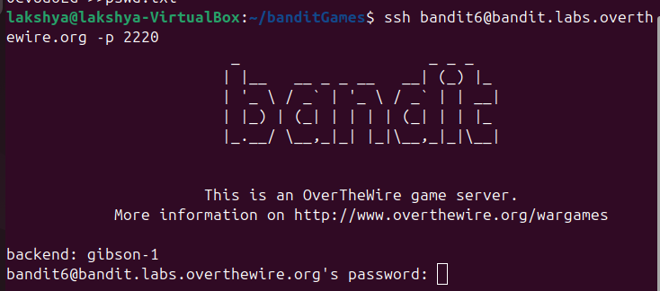
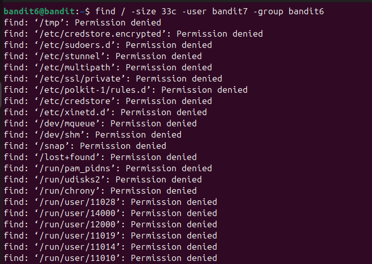
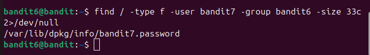
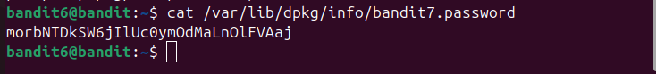

## Bandit level 6→7
Go to website https://overthewire.org/wargames/bandit for hint of each level.


## 🎯 Challenge
The goal is to find the password for the next level which is stored somewhere on the server and has all of the following properties:

- owned by user bandit7
- owned by group bandit6
- 33 bytes in size

We are given:

- Host: `bandit.labs.overthewire.org`
- Port: `2220`
- Username: `bandit6`
- Password: `(use the one from Level 5→6)`

In the previous level, we retrieved the password that lets us log in as [bandit6](level5-6.md)

## 📝 Steps

1. **Open your terminal**

On your Linux machine, launch the terminal application.

2. **Run the SSH command**

Type the following command and press **Enter**:
   ```bash
   ssh bandit6@bandit.labs.overthewire.org -p 2220
   ```

<details>

- `ssh` : Secure Shell, used to connect to remote servers
- `bandit6@...`  : Username and host
- `-p 2220`  : specifies the custom port 2220(default uses port 22)
</details>



3. **Enter password**
   ```bash 
   HWasnPhtq9AVKe0dmk45nxy20cvUa6EG__laksh 
   ```
(Note: The password will remain hidden as you type — this is normal.)

⚠️ **Disclaimer**: Password is intentionally altered. Use the actual one you retrieved in the previous level.

4. **Retrieve password for Level7**

- We use `find` to locate a file that is exactly **33 bytes**, owned by user **bandit7** and group **bandit6**.

```bash
find / -type f -size 33c -user bandit7 -group bandit6 2>/dev/null
```
<details>

- `find`  : used to search for files and directories. It can look inside folders and apply filters (like type, name, size).
- `find /` : it tells `find` to look inside the folder **/**(means the root directory)
- `-type f` : Restricts the search to files only (not directories).

  command works fine even without it as well

- `-size` : This flag filters the result by size.

  `33c` : `c` = "bytes"(character count)

- `user bandit7` : Filters files owned by the user **bandit7**
- `-group bandit6` : Filters files owned by the group bandit6.

- `2>/dev/null` : This hides error messages like ‘Permission denied’ so you only see useful results

    Without `2>/dev/null` :

  

</details>

---



### ⚡ Quick Tips
- Use `ls -lh` to check file sizes and permissions.

- Run `file <filename>` to confirm it’s a text file before cat.

---
- Read the file `bandit7.password`
```bash
cat /var/lib/dpkg/info/bandit7.password
```



You can copy the password


- **Exit the session**
```bash
exit 
   ```


---
### 📜All used commands
<details>

- `ssh username@host` : Secure Shell, used to connect to remote servers
- `find`  : used to search for files and directories. It can look inside folders and apply filters (like type, name, size).
- `cat <filename>` : read and display the contents of file
- `exit` : closes current shell session
</details>

---
✨ Pro tip: You can always refer to the manual pages for deeper understanding.
Just type:
```bash
man <command>
```
for example :
```bash
man ls
```
### ✅ Summary
- Log in as bandit6
- Use `find` with filters to locate the file
- Read the file with `cat`
- The output is the password for bandit7

---
#### 💬 Need help?
- [ExplainShell](https://explainshell.com): Paste any command (like `ls -lh`) and it breaks down each flag and argument.
- Reading resource :  [Linux Command Line and Shell Scripting Bible](https://github.com/linuxqueenn12/popular-Hacking-books-/blob/833e3e07dea7c463137ac6b689e1eba3236a5029/Linux%20Command%20Line%20and%20Shell%20Scripting%20Bible%203rd%20Edition%20%7BPRG%7D.pdf)

[Text me on WhatsApp ➡️](https://wa.me/918619372532?text=Hello)