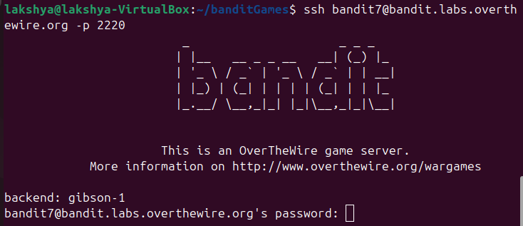

## Bandit level 7→8
Go to website https://overthewire.org/wargames/bandit for hint of each level.


## 🎯 Challenge
The goal is to find the password for the next level which is stored in the file data.txt next to the word millionth

We are given:

- Host: `bandit.labs.overthewire.org`
- Port: `2220`
- Username: `bandit7`
- Password: `(use the one from Level 6→7)`

In the previous level, we retrieved the password that lets us log in as [bandit7](level6-7.md)

## 📝 Steps

1. **Open your terminal**

On your Linux machine, launch the terminal application.

2. **Run the SSH command**

Type the following command and press **Enter**:
   ```bash
   ssh bandit7@bandit.labs.overthewire.org -p 2220
   ```

<details>

- `ssh` : Secure Shell, used to connect to remote servers
- `bandit7@...`  : Username and host
- `-p 2220`  : specifies the custom port 2220(default uses port 22)
</details>



3. **Enter password**
   ```bash 
   morbNTDkSW6jILUc0ymOdMaLn0LFVAaj__laksh 
   ```
(Note: The password will remain hidden as you type — this is normal.)

⚠️ **Disclaimer**: Password is intentionally altered. Use the actual one you retrieved in the previous level.

4. **Retrieve password for Level8**

- We need to search inside data.txt for the line containing the word millionth

```bash
grep millionth data.txt
```
<details>

- `grep` : searches for text patterns in files
- `millionth` : the word we’re looking for
- `data.txt` : the file to search in
</details>

---


You can copy the password

### ⚡ Quick Tips
You can also use 
```bash
cat data.txt | grep millionth
```
 but
```bash
grep millionth data.txt
``` 
 is simpler.

---

- **Exit the session**
```bash
exit 
   ```


---
### 📜All used commands
<details>

- `ssh username@host` : Secure Shell, used to connect to remote servers
- `grep` : searches for text patterns in files
- `exit` : closes current shell session
</details>

---
✨ Pro tip: You can always refer to the manual pages for deeper understanding.
Just type:
```bash
man <command>
```
for example :
```bash
man ls
```
### ✅ Summary
- Log in as bandit7
- Use `grep` to search for the word "millionth" in data.txt
- The line will reveal the password for bandit8

---
#### 💬 Need help?
- [ExplainShell](https://explainshell.com): Paste any command (like `ls -lh`) and it breaks down each flag and argument.
- Reading resource :  [Linux Command Line and Shell Scripting Bible](https://github.com/linuxqueenn12/popular-Hacking-books-/blob/833e3e07dea7c463137ac6b689e1eba3236a5029/Linux%20Command%20Line%20and%20Shell%20Scripting%20Bible%203rd%20Edition%20%7BPRG%7D.pdf)

[Text me on WhatsApp ➡️](https://wa.me/918619372532?text=Hello)