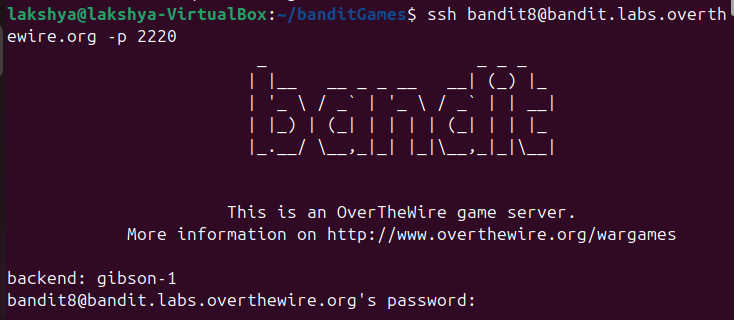
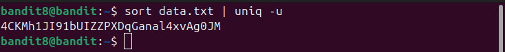

## Bandit level 8→9
Go to website https://overthewire.org/wargames/bandit for hint of each level.


## 🎯 Challenge
The goal is to find the password for the next level which is stored in the file data.txt and is the only line of text that occurs only once

We are given:

- Host: `bandit.labs.overthewire.org`
- Port: `2220`
- Username: `bandit8`
- Password: `(use the one from Level 7→8)`

In the previous level, we retrieved the password that lets us log in as [bandit8](level7-8.md)

## 📝 Steps

1. **Open your terminal**

On your Linux machine, launch the terminal application.

2. **Run the SSH command**

Type the following command and press **Enter**:
   ```bash
   ssh bandit8@bandit.labs.overthewire.org -p 2220
   ```

<details>

- `ssh` : Secure Shell, used to connect to remote servers
- `bandit8@...`  : Username and host
- `-p 2220`  : specifies the custom port 2220(default uses port 22)
</details>



3. **Enter password**
   ```bash 
   dfwvzFQi4mU0wfNbFOe9RoWskMLg7eEc__laksh 
   ```
(Note: The password will remain hidden as you type — this is normal.)

⚠️ **Disclaimer**: Password is intentionally altered. Use the actual one you retrieved in the previous level.

4. **Retrieve password for Level9**

- We need to filter data.txt to find the line that occurs only once.

```bash
sort data.txt | uniq -u
```
<details>

- `sort data.txt` 

  - This command sorts the contents of data.txt in alphabetical order
  - Sorting is important because `uniq` only works on adjacent duplicate lines. Without sorting, duplicates might be scattered and **uniq** wouldn’t catch them.
- `|`**(pipe)** : The pipe takes the output of the first command (sort data.txt) and sends it as input to the next command (uniq -u).
- `uniq -u` : `uniq` removes duplicate lines, but with the `-u` option it does the opposite: it shows only the unique lines
</details>

---



You can copy the password

### ⚡ Quick Tips
- Use `sort data.txt | uniq -c` to count how many times each line appears. The line with count `1` is the password.
- **Remember**: `uniq` only works on adjacent duplicates, so sorting first is essential.


- **Exit the session**
```bash
exit 
   ```


---
### 📜All used commands
<details>

- `ssh username@host` : Secure Shell, used to connect to remote servers
- `sort` : sorts the contents of a file in alphabetical order
- `uniq` : removes duplicate lines
- `exit` : closes current shell session
</details>

---
✨ Pro tip: You can always refer to the manual pages for deeper understanding.
Just type:
```bash
man <command>
```
for example :
```bash
man ls
```
### ✅ Summary
- Log in as bandit8
- Run `sort data.txt | uniq -u`
- The output will be the unique line containing the password for bandit9
- Exit the session

---
#### 💬 Need help?
- [ExplainShell](https://explainshell.com): Paste any command (like `ls -lh`) and it breaks down each flag and argument.
- Reading resource :  [Linux Command Line and Shell Scripting Bible](https://github.com/linuxqueenn12/popular-Hacking-books-/blob/833e3e07dea7c463137ac6b689e1eba3236a5029/Linux%20Command%20Line%20and%20Shell%20Scripting%20Bible%203rd%20Edition%20%7BPRG%7D.pdf)

[Text me on WhatsApp ➡️](https://wa.me/918619372532?text=Hello)