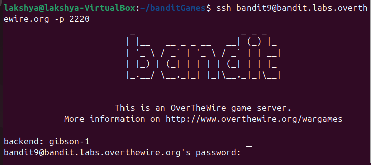
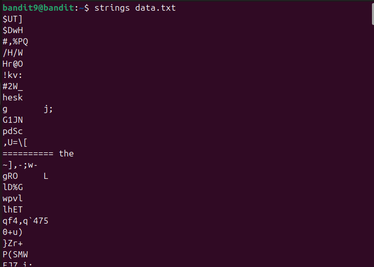
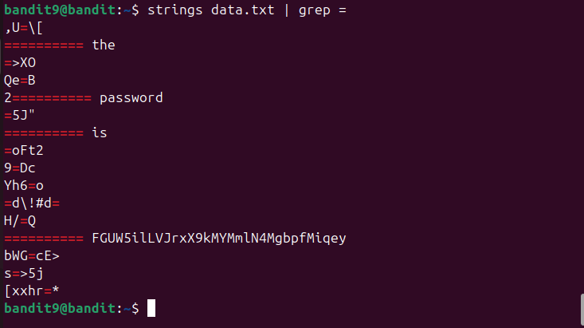
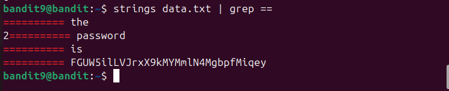

## Bandit level 9→10
Go to website https://overthewire.org/wargames/bandit for hint of each level.


## 🎯 Challenge
The goal is to find the password for the next level which is stored in the file data.txt in one of the few human-readable strings, preceded by several ‘=’ characters.

We are given:

- Host: `bandit.labs.overthewire.org`
- Port: `2220`
- Username: `bandit9`
- Password: `(use the one from Level 8→9)`

In the previous level, we retrieved the password that lets us log in as [bandit9](level8-9.md)

## 📝 Steps

1. **Open your terminal**

On your Linux machine, launch the terminal application.

2. **Run the SSH command**

Type the following command and press **Enter**:
   ```bash
   ssh bandit9@bandit.labs.overthewire.org -p 2220
   ```

<details>

- `ssh` : Secure Shell, used to connect to remote servers
- `bandit9@...`  : Username and host
- `-p 2220`  : specifies the custom port 2220(default uses port 22)
</details>



3. **Enter password**

   Type the password you retrieved from Level 8 → 9

(⚠️**Note**: The password will remain hidden as you type — this is normal.)

4. **Retrieve password for Level9**

- The file **data.txt** contains many strings. We need to extract the human‑readable one that is preceded by `=` characters. Use the `strings` command to extract readable text, followed by `grep` to filter that text :
```bash
strings data.txt | grep ==
```
<details>

- `strings data.txt` : extracts readable text from a binary file

    

- `|`**(pipe)** : sends the output of one command into another
- `grep ==` : filters only lines containing `==`
    
    If we just want those starting with **=** :

    
</details>

---



You can copy the password

### ⚡ Quick Tips
- If you’re unsure, run just `strings data.txt` first to see all readable text.
- `grep` helps you narrow down the output to the exact pattern you’re looking for.

- **Exit the session**
```bash
exit 
   ```


---
### 📜All used commands
<details>

- `ssh username@host` : Secure Shell, used to connect to remote servers
- `strings` : extract human‑readable text from binary files
- `grep` : search for patterns in text
- `exit` : closes current shell session
</details>

---
✨ Pro tip: You can always refer to the manual pages for deeper understanding.
Just type:
```bash
man <command>
```
for example :
```bash
man ls
```
### ✅ Summary
- Log in as bandit9
- Run strings data.txt | grep ==
- The output will be the password for bandit10
- Exit the session

---
#### 💬 Need help?
- [ExplainShell](https://explainshell.com): Paste any command (like `ls -lh`) and it breaks down each flag and argument.
- Reading resource :  [Linux Command Line and Shell Scripting Bible](https://github.com/linuxqueenn12/popular-Hacking-books-/blob/833e3e07dea7c463137ac6b689e1eba3236a5029/Linux%20Command%20Line%20and%20Shell%20Scripting%20Bible%203rd%20Edition%20%7BPRG%7D.pdf)

[Text me on WhatsApp ➡️](https://wa.me/918619372532?text=Hello)